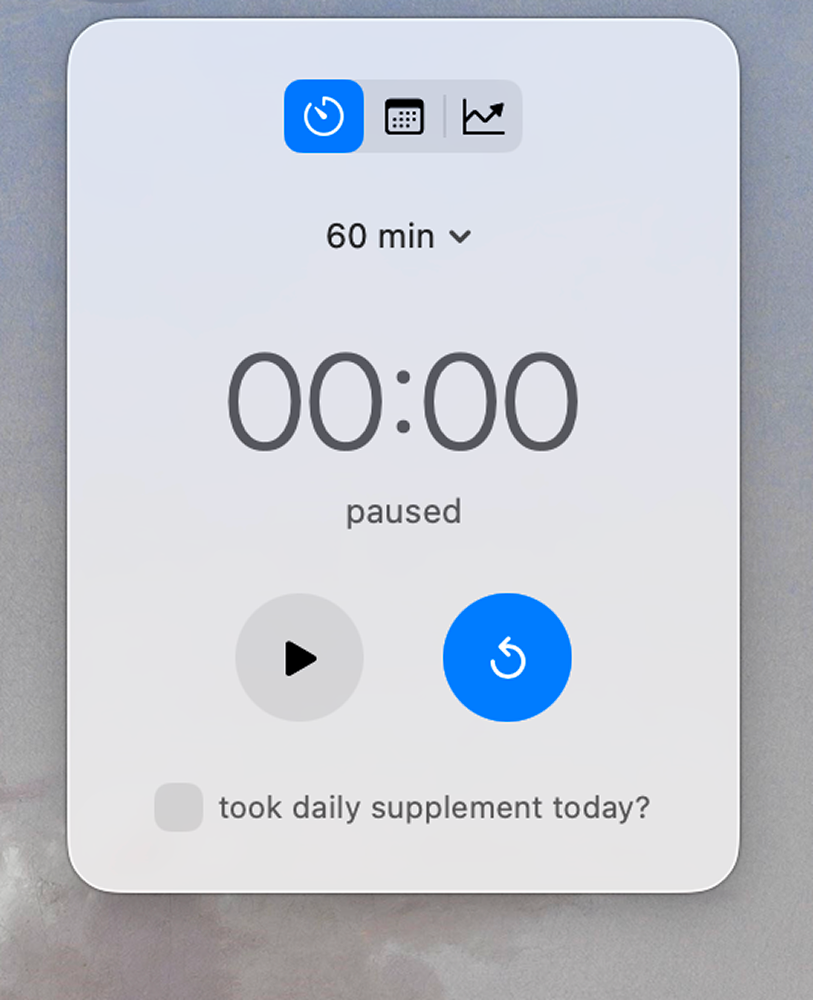
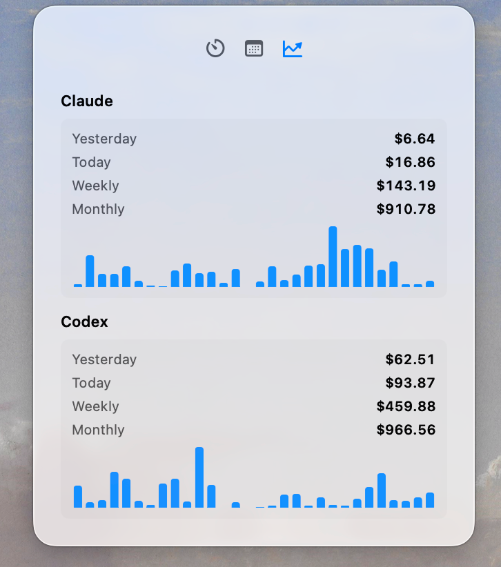

# ModernWidget

Small macOS menu bar app for people who sit too long and spend too much time with coding agents.


## What it does

ModernWidget lives in the menu bar and opens a compact glass-style panel with three panes:

- **Break timer**: 60 or 120 minute countdown, pause/resume, overdue state, and native reminders.
- **Walk history**: monthly calendar with per-day walk counts and daily supplement status.
- **AI usage**: local Claude, Codex, and Pi usage cost summaries with a 30-day mini chart.

Everything runs locally. State is stored with `UserDefaults`, and AI usage is read from local Claude, Codex, and Pi JSONL logs.

## Screenshots

| Break timer | Walk history | AI usage |
| --- | --- | --- |
|  |  |  |

## Features

### Break reminders

- Menu bar status icon reflects running, paused, and overdue states.
- Countdown presets: `60 min` and `120 min`.
- Pause and resume preserve elapsed progress.
- Reset completes a break, records a walk, and restarts the countdown.
- Native macOS notifications repeat while the reminder stays overdue.
- Timer state survives app restarts.

### Health tracking

- Walks are grouped by calendar day.
- History calendar keeps the current month plus the previous two months.
- Daily supplement checkbox is shown on the timer pane.
- Calendar day labels indicate supplement completion for past days.

### AI usage tracking

- Claude usage is loaded from `CLAUDE_CONFIG_DIR`, `XDG_CONFIG_HOME/claude`, or `~/.claude`.
- Codex usage is loaded from `CODEX_HOME` or `~/.codex`.
- Pi usage is loaded from `PI_AGENT_DIR` or `~/.pi/agent/sessions`.
- Active and archived Codex sessions are deduplicated.
- Claude sidechain duplicates are collapsed.
- Pi entries with missing output infer output from total tokens; explicit zero output stays zero.
- Cost estimates support known Claude and GPT/Codex/Pi model pricing.
- The panel refreshes usage roughly every 10 minutes.

## Requirements

- macOS 26.0+
- Swift 6.3+
- `swift-format` for formatting

## Build and run

```bash
swift-format format --in-place --recursive Sources/ Tests/
swift build
swift test
script/build_and_run.sh
```

The app bundle is created at `dist/ModernWidget.app` and ad-hoc signed for local use.

## Auto updates

Release builds use Sparkle and read their appcast from the rolling GitHub release:

```text
https://github.com/theBucky/modern-widget/releases/latest/download/appcast.xml
```

GitHub Actions publishes both `ModernWidget.dmg` and `appcast.xml` to the `latest` release. Configure these repository secrets before publishing:

- `SPARKLE_PUBLIC_ED_KEY`: public key copied into `Info.plist`.
- `SPARKLE_PRIVATE_ED_KEY`: private key consumed by Sparkle's `generate_appcast`.

Generate and export keys after Sparkle has been resolved:

```bash
.build/artifacts/sparkle/Sparkle/bin/generate_keys --account modern-widget
.build/artifacts/sparkle/Sparkle/bin/generate_keys --account modern-widget -x sparkle_private_key.txt
```

Use the printed public key for `SPARKLE_PUBLIC_ED_KEY`; use the exported file contents for `SPARKLE_PRIVATE_ED_KEY`.

### Build script modes

| Mode | Description |
| --- | --- |
| `run` | Build and launch the app. Default mode. |
| `bundle` | Build and self-sign the app bundle without launching. |
| `debug` | Build and launch the executable in `lldb`. |
| `logs` | Launch the app and stream process logs. |
| `telemetry` | Launch the app and stream subsystem logs. |
| `verify` | Launch the app and verify the process started. |

```bash
script/build_and_run.sh debug
script/build_and_run.sh logs
script/build_and_run.sh verify
```

## Coding usage benchmark

Use the benchmark script to measure the usage refresh pipeline. It reports `scan`, `load`,
`startup`, and `refresh.no_change` timings with min, mean, p50, p95, and max milliseconds.

```bash
script/benchmark_coding_usage.sh --mode real
script/benchmark_coding_usage.sh --mode fixture --fixture-files 90 --fixture-lines 400
```

Add hard optimization gates by passing p95 limits:

```bash
script/benchmark_coding_usage.sh \
  --mode fixture \
  --max-scan-p95-ms 25 \
  --max-load-p95-ms 500 \
  --max-startup-p95-ms 550 \
  --max-refresh-p95-ms 25
```

## Project structure

```text
Sources/ModernWidget/
├── App/
│   └── ModernWidgetApp.swift              # SwiftUI app entry and MenuBarExtra scene
├── Models/
│   ├── HistoryRetention.swift             # shared three-month retention window
│   ├── LocalDay.swift                     # shared calendar-day key for walk, supplement, and retention logic
│   ├── Reminder/
│   │   ├── ReminderNotificationIssue.swift  # notification permission and delivery issues
│   │   ├── ReminderSchedule.swift           # countdown phases and reminder timing
│   │   └── ReminderState.swift              # timer state, presets, and snapshots
│   ├── Usage/
│   │   ├── CodingTokenCounts.swift          # token and cost totals
│   │   ├── CodingUsageDateScope.swift       # usage reporting windows
│   │   └── CodingUsageSummary.swift         # coding agent usage report models
│   └── WalkHistory/
│       └── WalkHistoryCalendar.swift        # month grid and weekday helpers
├── Resources/                             # Claude, Codex, and Pi logo assets
├── Services/
│   ├── DailySupplementStore.swift         # daily supplement persistence
│   ├── Reminder/
│   │   ├── ReminderEngine.swift           # timer engine and state persistence
│   │   └── ReminderNotifier.swift         # native notification delivery
│   ├── Usage/
│   │   ├── CodingUsageLoader.swift        # scan and load orchestration
│   │   ├── CodingUsageStore.swift         # observable store and refresh loop
│   │   ├── Claude/                        # Claude log loading
│   │   ├── Codex/                         # Codex log loading
│   │   ├── Pi/                            # Pi log loading
│   │   └── Shared/                        # file scanning, JSON parsing, pricing
│   └── WalkHistoryStore.swift             # walk persistence and day counts
└── Views/
    ├── MenuBarPanelView.swift             # tabbed menu bar panel shell
    ├── PanelLayout.swift                  # shared panel layout constants
    ├── ReminderPaneView.swift             # timer, controls, supplement checkbox
    ├── SettingsPaneView.swift             # settings and app controls
    ├── WalkHistoryCalendarView.swift      # calendar pane
    ├── Usage/                             # AI usage pane, chart, formatting, and totals
    └── MenuBarIconView.swift              # menu bar status icon

Tests/ModernWidgetTests/
├── LocalDayTests.swift                    # shared day-key behavior
├── ReminderEngineTests.swift              # timer engine behavior
├── ReminderNotificationIssueTests.swift   # notification issue mapping
├── ReminderScheduleTests.swift            # reminder schedule timing
├── ReminderStateTests.swift               # reminder state transitions
├── WalkHistoryCalendarTests.swift         # calendar grid
├── WalkHistoryStoreTests.swift            # walk persistence
├── HistoryRetentionTests.swift            # retention window
├── DailySupplementStoreTests.swift        # supplement persistence
├── TestSupport.swift                      # shared test helpers
└── Usage/                                 # Claude/Codex/Pi loader, parser hardening, summary, benchmark tests
```

## Data and privacy

- No server component.
- No analytics.
- No network calls for usage tracking.
- Local app state is stored in `UserDefaults`.
- AI usage summaries are computed from local Claude, Codex, and Pi log files.
