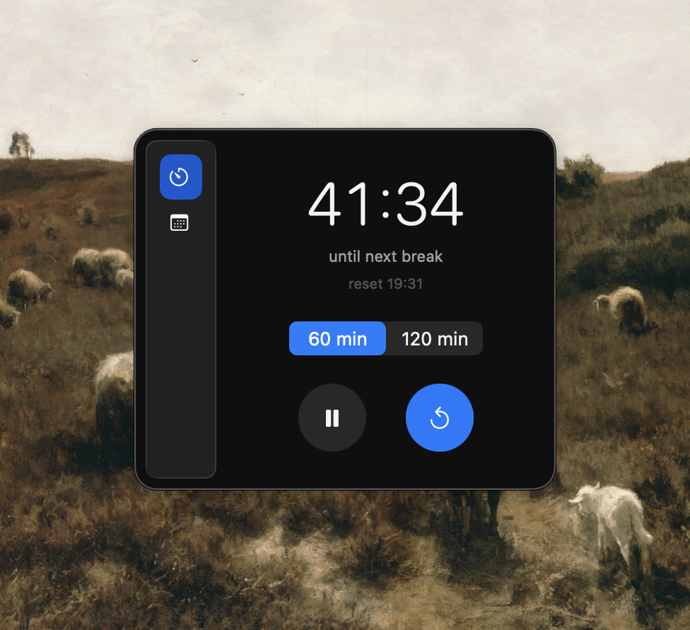

# ModernWidget

macOS menu bar app that reminds you to get off your chair and move.


## Features

- **Countdown timer** in the menu bar showing time until next break
- **Configurable intervals**: 60 or 120 minutes
- **Pause/resume** without losing progress
- **Walk history** with 30-day calendar view
- **Native notifications** when timer expires, repeating at interval until reset

## Screenshot



## Requirements

- macOS 14.0+
- Swift 6.3+

## Build

```bash
# format sources
swift-format format --in-place --recursive Sources/

# build
swift build

# build, sign, and run
script/build_and_run.sh
```

### Build script modes

| Mode | Description |
|------|-------------|
| `run` | Default. Build and launch the app |
| `debug` | Launch in lldb |
| `logs` | Launch and stream process logs |
| `telemetry` | Launch and stream subsystem logs |
| `verify` | Launch and verify process started |

```bash
script/build_and_run.sh debug
script/build_and_run.sh logs
```

## Project Structure

```
Sources/ModernWidget/
├── Models/App/          # app entry point
├── Services/            # state, notifications, history
│   ├── ReminderEngine   # countdown logic, persistence
│   ├── ReminderNotifier # macOS notification delivery
│   ├── WalkHistoryStore # 30-day walk log
│   └── *ViewModel       # UI state binding
└── Views/               # SwiftUI views
    ├── MenuBarContentView
    └── CalendarView
```

## How It Works

1. Timer counts down from the selected interval (default 60 min)
2. When timer reaches zero, a notification fires: "get off chair. short walk now."
3. Notification repeats at the interval until you reset
4. Resetting logs a walk to history and restarts the countdown
5. State persists across app restarts via UserDefaults

## License

MIT
