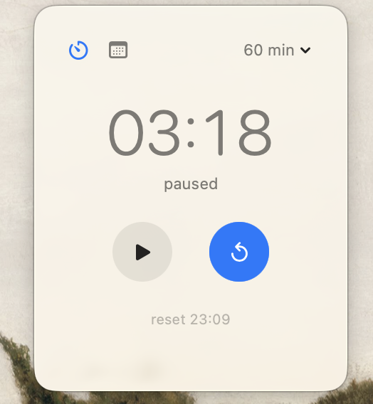
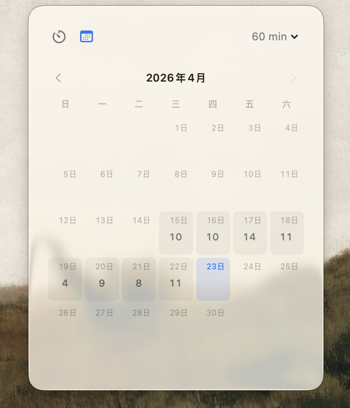

# ModernWidget

macOS menu bar app that reminds you to get off your chair and move.


## Features

- Countdown timer in the menu bar with a progress ring icon
- Interval selector (60 or 120 min) exposed in the popover header
- Pause and resume without losing elapsed progress
- Walk history with a month calendar grid and per-day counts
- Liquid glass popover panel backed by `NSStatusItem`, pane-aware sizing
- Native notifications when the timer expires, repeating at interval until reset

## Screenshots

| Timer | Calendar |
|-------|----------|
|  |  |

## Requirements

- macOS 26.0+
- Swift 6.3+

## Build

```bash
# format sources
swift-format format --in-place --recursive Sources/

# build
swift build

# build, sign, and run
script/build_and_run.sh
```

Signed bundle lands in `dist/ModernWidget.app`.

### Build script modes

| Mode | Description |
|------|-------------|
| `run` | Default. Build and launch the app |
| `debug` | Launch in lldb |
| `logs` | Launch and stream process logs |
| `telemetry` | Launch and stream subsystem logs |
| `verify` | Launch and verify process started |

```bash
script/build_and_run.sh debug
script/build_and_run.sh logs
```

## Project Structure

```
Sources/ModernWidget/
├── Models/App/            # entry point, app delegate
├── Services/
│   ├── MenuBarController  # NSStatusItem + popover panel
│   ├── MenuBarViewModel   # status item title state
│   ├── PopupViewModel     # popover pane state
│   ├── RefreshLoop        # tick scheduler
│   ├── ReminderEngine     # countdown logic, persistence
│   ├── ReminderNotifier   # macOS notification delivery
│   └── WalkHistoryStore   # walk log
└── Views/
    ├── MenuBarContentView # popover body
    ├── MenuBarIconView    # status bar icon + title
    ├── ProgressRing       # countdown ring
    └── CalendarView       # month grid with counts
```

## How It Works

1. Timer counts down from the selected interval (default 60 min)
2. Menu bar shows a progress ring and remaining time
3. When the timer hits zero, a notification fires: "get off chair. short walk now."
4. Notification repeats at the interval until reset
5. Reset logs a walk to history and restarts the countdown
6. State persists across app restarts via `UserDefaults`

## License

MIT
